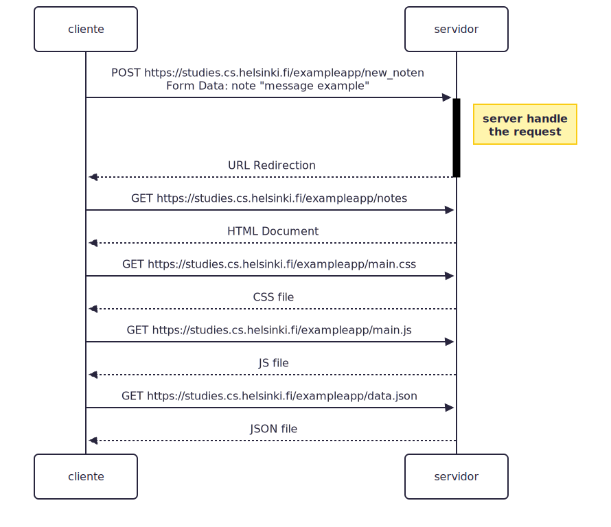

---
config:
  theme: redux
  look: neo
---
sequenceDiagram
  participant cliente as cliente
  participant servidor as servidor
  cliente ->>+ servidor: POST https://studies.cs.helsinki.fi/exampleapp/new_noten   Form Data: note "message example"
  Note right of servidor: server handle   the request
  servidor -->>- cliente: URL Redirection
  cliente ->> servidor: GET https://studies.cs.helsinki.fi/exampleapp/notes
  servidor -->> cliente: HTML Document
  cliente ->> servidor: GET https://studies.cs.helsinki.fi/exampleapp/main.css
  servidor -->> cliente: CSS file
  cliente ->> servidor: GET https://studies.cs.helsinki.fi/exampleapp/main.js
  servidor -->> cliente: JS file
  cliente ->> servidor: GET https://studies.cs.helsinki.fi/exampleapp/data.json
  servidor -->> cliente: JSON file
